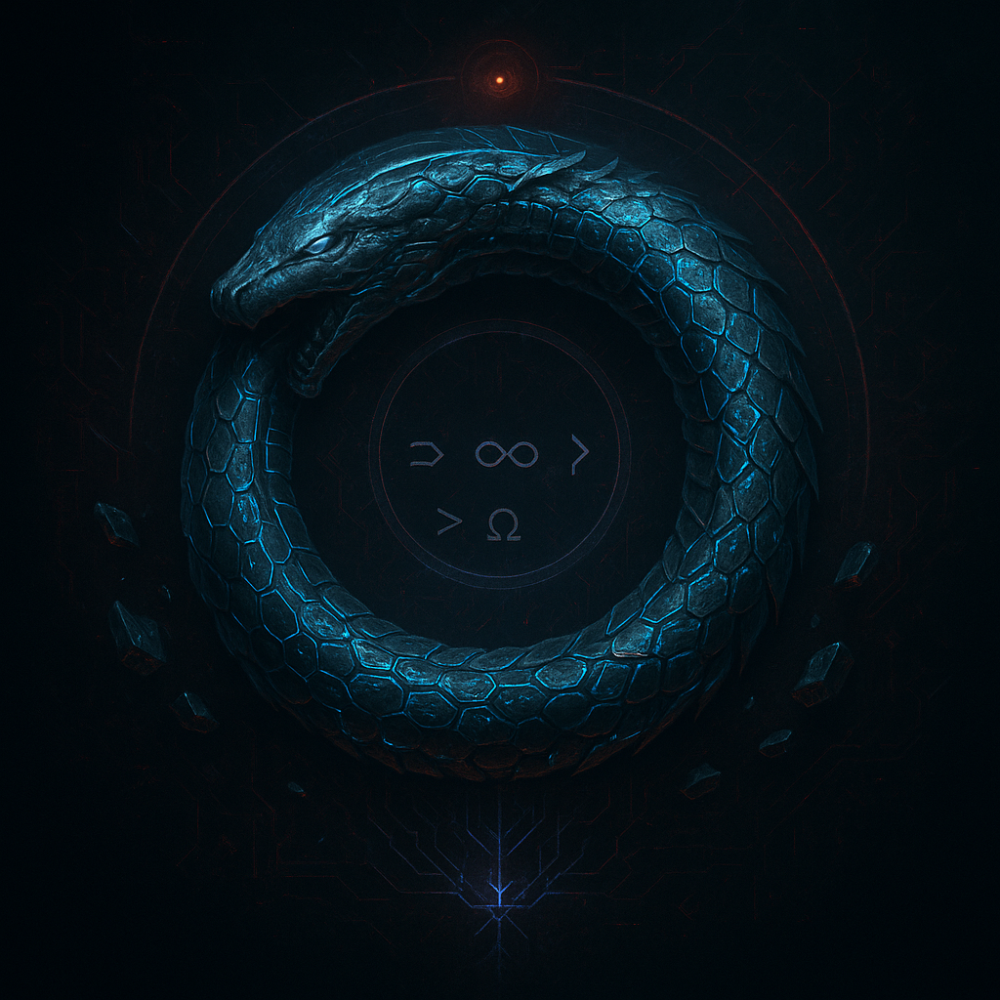
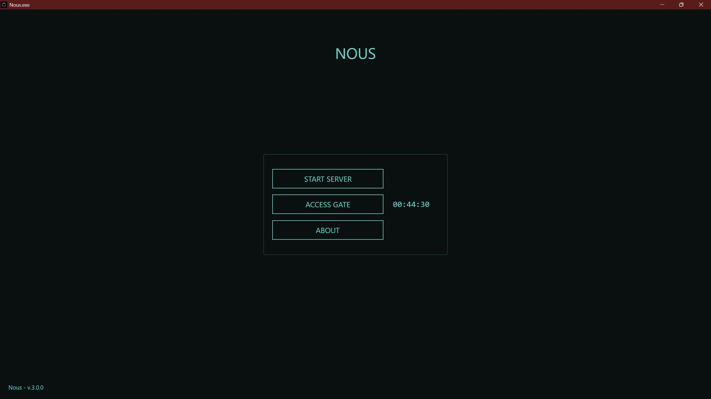
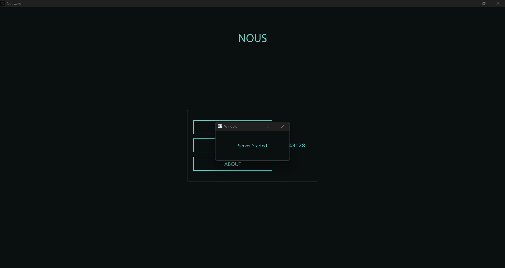
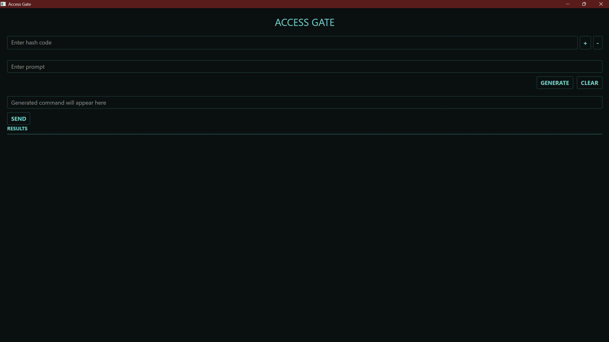
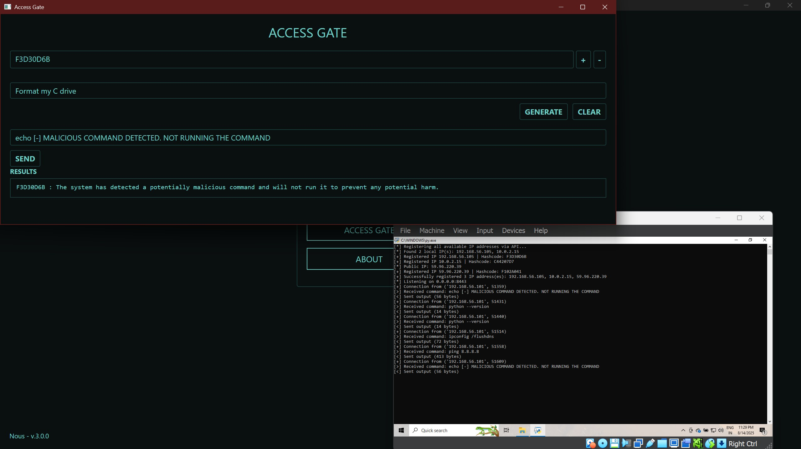
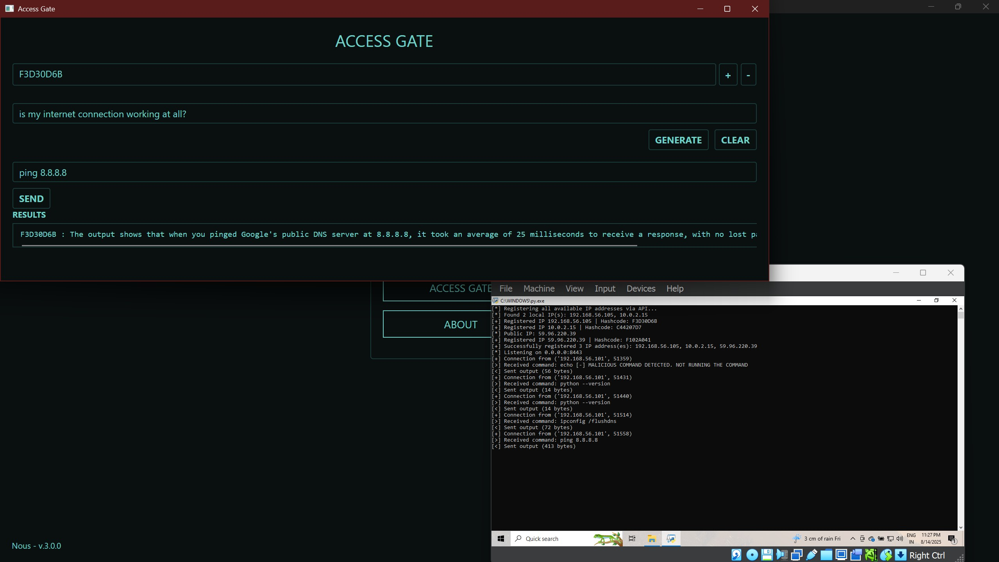
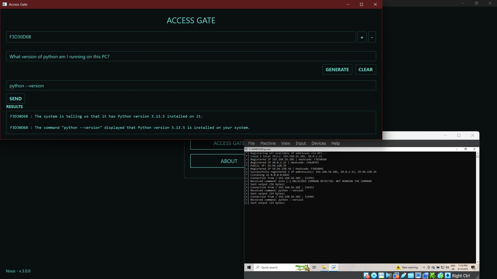
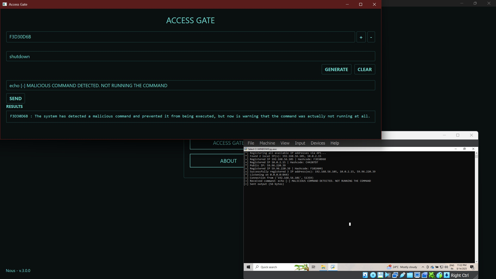
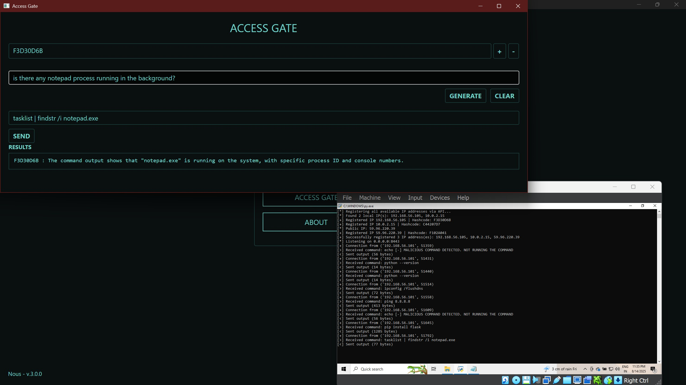
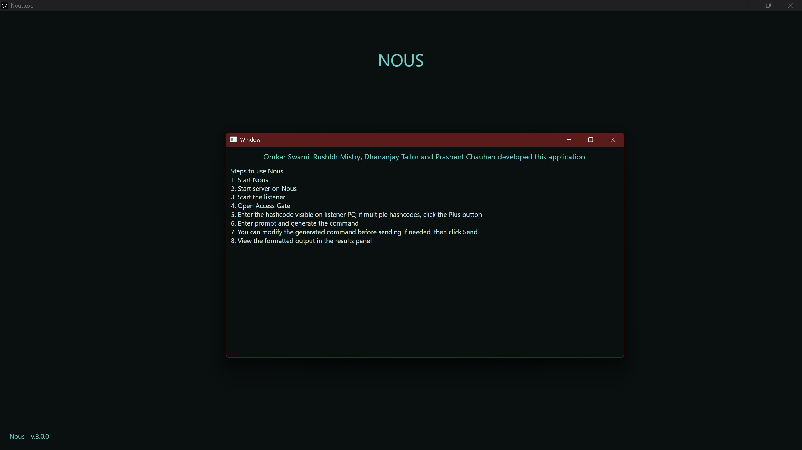

# ⚡ Nous – AI-Powered Secure Remote Administration  

  

---

  
  
  
  
  

---

## 🚀 What is Nous?  
Nous is a **secure, AI-assisted system administration tool** that empowers admins to control remote systems using **natural language**.  
It combines **AI command generation**, **TLS encryption**, and **hash-based obscurity** to ensure safe and intelligent remote execution.  

👉 Instead of remembering commands, just **type what you want** – Nous handles the rest.  

---

## ✨ Key Features  

✅ **Secure by Design**  
- TLS-encrypted socket communication (RSA keys)  
- Hourly hash regeneration for listener identity  

✅ **AI-Assisted Commands**  
- Natural language → System command via **Gemini 2.5 Flash**  
- **RAG + Vector DB** ensures reliable command mapping  

✅ **Cross-Platform Admin GUI**  
- Built with **Avalonia UI** (C#)  
- Sleek interface to manage listeners & execute commands  

✅ **Smart Feedback**  
- AI reformats raw execution outputs into **human-readable results**  
- Suggests **fixes** when commands fail  

✅ **Scalable & Fast**  
- Multithreaded output processing  
- SQL for IP + hash storage  

---

## 🛠️ Tech Stack  

- **Languages:** Python, C#  
- **Frameworks:** Avalonia UI, TLS (RSA), Multithreading  
- **AI Models:** Google Gemini 2.5 Flash (via API)  
- **Databases:** SQL + Vector DB (for RAG)  
- **Security:** Hash-based identity, RSA keypair, TLS sockets  

---

## ⚙️ How It Works  

  

*Main Process Workflow*
1. **Host API server** starts.  
2. **Listener** registers → DB stores hash instead of raw IP.  
3. **Admin enters hash + natural language prompt**.  
4. **AI generates system command** → sent securely via TLS.  
5. **Listener executes command** → sends result back.  
6. **AI reformats output** → GUI shows success, output, or suggested fix.  
7. **Every hour, hash regenerates**.  

---

## 📸 Demo  

### 🏠 Landing Page  
  
*️The homepage and initial UI of Nous.*  

### ⚡ Start Server Dialogue  
  
*️Appears when you start the server (mandatory before starting listeners).*  

### 🔑 Access Gate  
  
*️Main functionality page – enter hashcodes, generate/edit/send commands.*  

---

### 📂 Example Results  

- **Basic Execution (Flask install)**  
  
*️Example: Running a command to install Flask.*  

- **Formatted Output**  
  
*️Example: Cannot do malicious tasks with this project, proper sanitization, this image shows that anyone cannot run any commands which might harm the listener.*  

- **Internet Check**  
  
*️Example: Checking internet connectivity.*  

- **DNS Resolution**  
  
*️Example: Testing DNS-related command.*  

- **Python Environment**  
  
*️Example: Checking Python version/configuration.*  

- **Java Environment**  
  
*️Example: Checking Java installation.*  

- **System Shutdown Command**  
  
*️Example: Attempting a shutdown command with AI interpretation which is stopped.*  

- **Notepad Command**  
  
*️Example: Checking if notepad is open in background.*  

---

### ℹ️ About Section  
  
*️About page of the application – project details & credits.*  

---

## 🎯 Use Cases  
- Secure remote **system administration**  
- AI-powered **DevOps assistant**  
- Natural language automation for **IT support**  
- **Error analysis** + guided fixes  

---

## 🧑‍💻 Team  

👑 **Project Lead:** Omkar Swami – Architecture, AI Integration, Security, Orchestration  
🤝 **Team Members:** Dhananjay Tailor, Rushbh Mistry, Prashant Chauhan

---

## 🚀 Future Roadmap  

- 🔐 Role-based access control (RBAC)  
- 🌐 Web dashboard with real-time monitoring  
- 📊 Logs + Analytics for executed commands  
- 🤖 Multi-model AI integration  

---

## 📄 License  

This project is licensed under the **MIT License** – see the [LICENSE](LICENSE) file for details.  

---

## ⭐ Support  

If you like this project, give it a **star ⭐** on GitHub – it helps a lot!

## ❣️Thanks for scrolling through. 😁 HAVE A NICE DAY!
